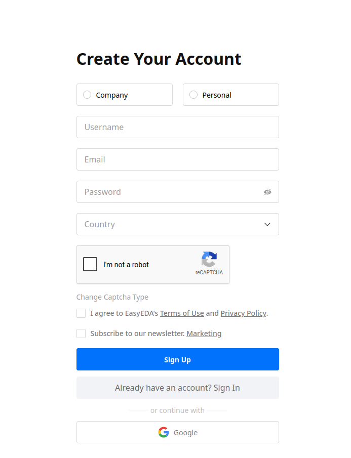
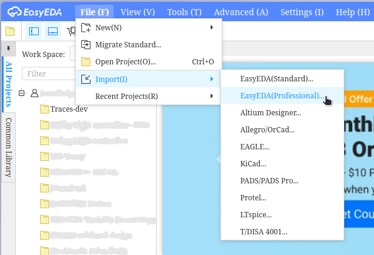
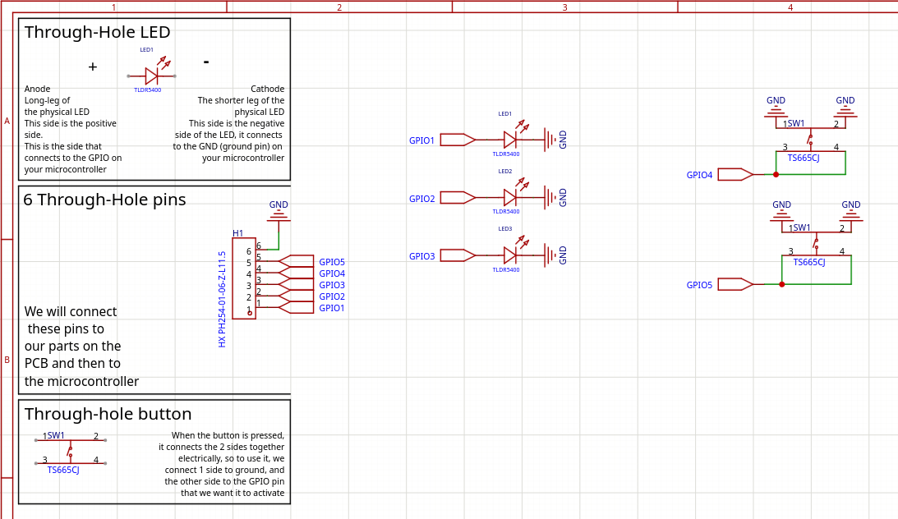
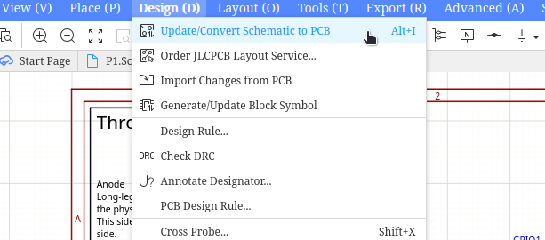
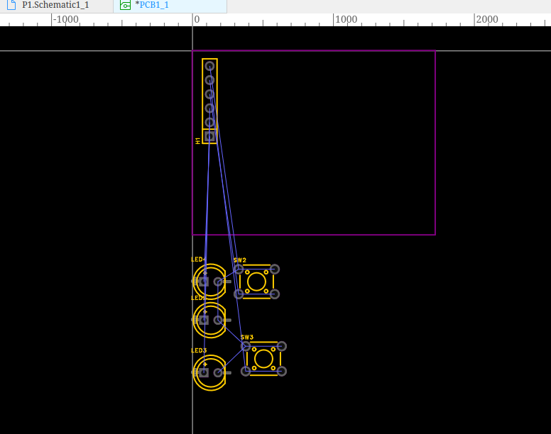
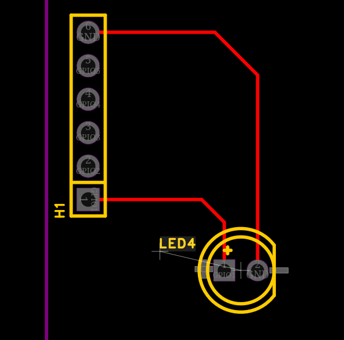
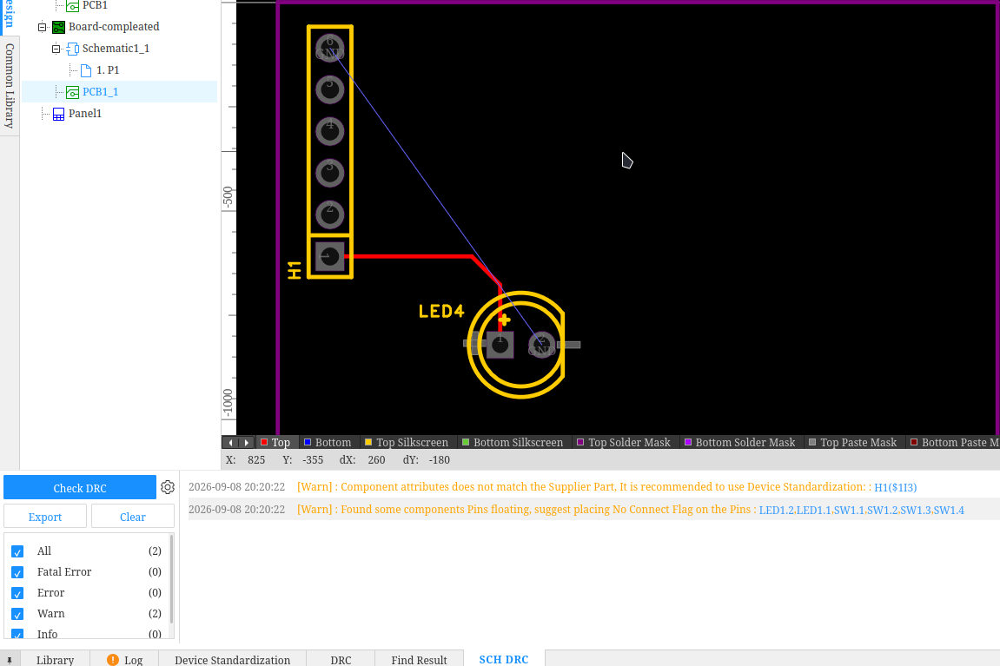
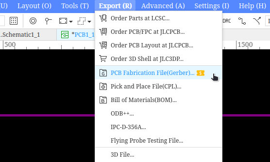
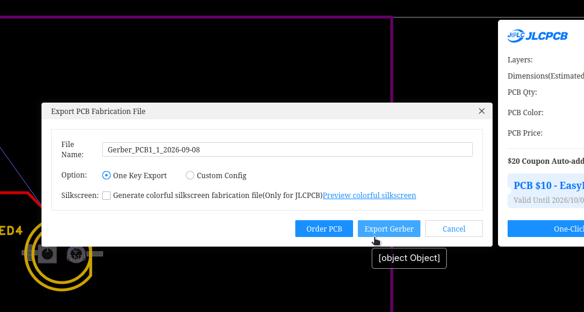

# PCB Guide: Bringing Your Circuit to Life

Now that you've designed and tested your circuit in Wokwi, it's time to turn it into a real physical object: a **Printed Circuit Board (PCB)**.

We'll be using **EasyEDA**, a powerful web-based tool that handles everything from schematics to the final board layout.

## 1. Getting Started
First, make an account [here](https://easyeda.com/register). 

Once you've logged in, you'll need to import the project file provided by your leader (the `.epro2` file).

1. Go to **File** → **Open** → **EasyEDA Source**.
2. Upload the `.epro2` file provided to you.

---

## 2. Understanding the Schematic
Before we jump into the board layout, we need to make sure the **Schematic** is correct. The schematic is the "blueprint" of your circuit—it doesn't care where components are physically located, only how they are connected.

**Checklist:**
- [ ] All components are connected to the correct pins.
- [ ] Power (VCC/5V) and Ground (GND) are clearly marked.
- [ ] There are no "floating" wires (wires that don't lead anywhere).

---

## 3. Converting to PCB
Once your schematic is ready, we can convert it into a physical layout.

1. Go to the top menu and select **Design** → **Convert to PCB**.

EasyEDA will now generate a PCB workspace. You'll see your components clustered together with thin blue lines called **"Ratsnest"** wires. These wires show you which pins *need* to be connected.

---

## 4. Placing Your Components
The goal of the layout is to place your components in a way that is compact, logical, and easy to route.

- **Start with the "Anchor"**: Place your most important component (like the microcontroller or a large connector) first.
- **Group Related Parts**: Keep capacitors near the pins they support.
- **Avoid Overlap**: Make sure components aren't on top of each other.

---

## 5. Routing the Traces
This is the "Traces" part of the project! Routing is the process of replacing the blue "ratsnest" lines with actual copper tracks.

1. Select the **Track** tool from the routing palette.
2. Click a pin and follow the line to its destination.
3. **Avoid 90° Angles**: Instead of sharp right angles, use two 45° angles. This is better for signal integrity and looks more professional.
4. **Trace Width**: Use thicker traces for power and ground lines, and thinner traces for data signals.

---

## 6. The Final Check (DRC)
Before you ship your project, you must run a **Design Rule Check (DRC)**. This is like a spell-check for your hardware.

1. Go to **Design** → **DRC**.
2. If you see red markers, it means two traces are too close together or you have a short circuit.

3. Fix every single error until the DRC is clean.

---

## 7. Shipping Your Project
Once your DRC is clean and your traces look great:

1. Export your **Gerber Files** (the industry standard for PCB manufacturing).

2. Send your files to your leader so that they can order the circuit board for you!
